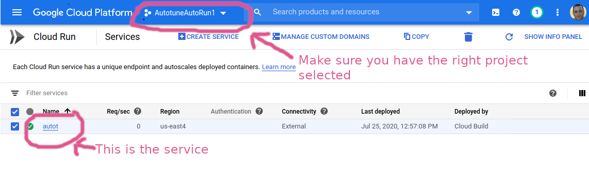
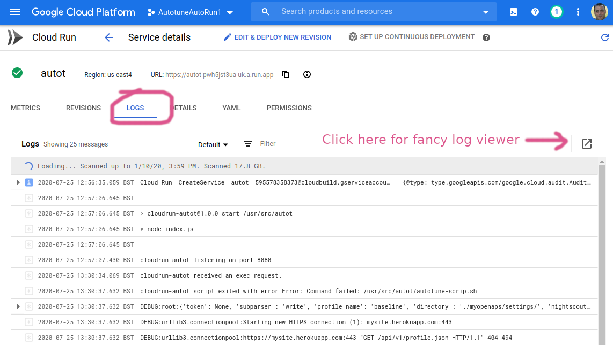

# Viewing Logs

Got to the [Cloud Run section](https://console.cloud.google.com/run) in the GCP console.

You should see your Cloud Run service:
 
 
 Now click the service and then click on the **logs** tab:
 
 
 
 